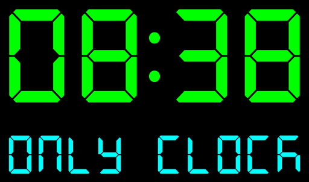

 # OrrClockLinux: Часики для линукс

  

  

## 🕰️ О Проекте

OrrClockLinux - это приложение для отображения красивых часов в Линукс.

## ✨ Ключевые Особенности

- 🌓 Адаптивный интерфейс для портретной и ландшафтной ориентации
- 🎨 Настраиваемая цветовая схема для цифровых часов
- 🔇 Настраиваемые звуковые уведомления

## 🛠 Технологии

- **Язык**: Python 3.8+
- **Фреймворк**: Kivy 2.2.1
- **Платформа**: Linux

## 🚀 Быстрый Старт

1. Клонируйте репозиторий
2. Установите зависимости: `pip install -r requirements.txt`
3. Запустите приложение: `python main.py`

## License

MIT License

## Author

Oruc Qafar - Python Developer
- GitHub: [OrrStudio](https://github.com/OrrStudio)
- Email: orr888@gmail.com
